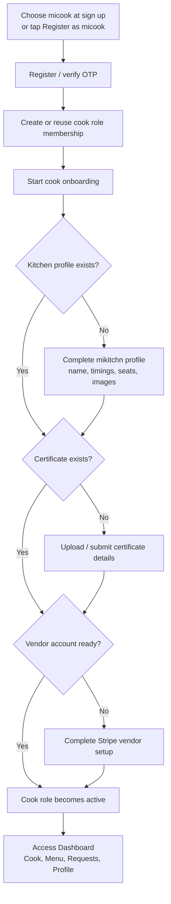
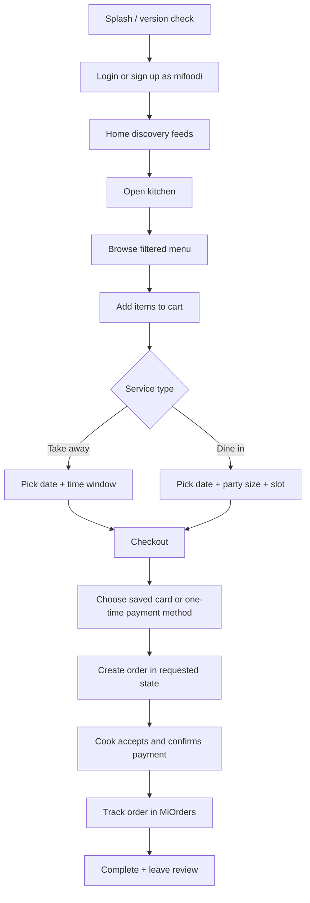
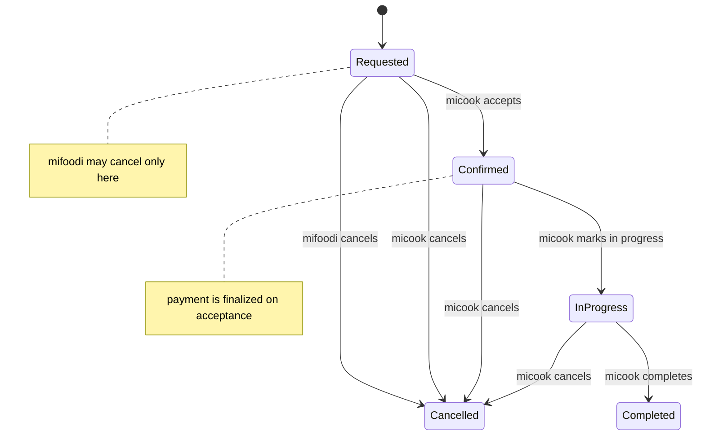

# Product + Journeys + UX Audit

## 0. Scope and audit coverage

- **Platforms covered:** Flutter mobile app plus the mobile-serving backend API.
- **Backend interface types detected:** REST endpoints were clearly present and used by the app; no GraphQL schema, resolvers, or mobile GraphQL client usage were found in the scanned codebase.
- **Out of scope by request:** website marketing flows, admin portal internals, and CRM UI except where they imply mobile/backend product behavior.

## 1. Personas and roles

### micook

A micook is the supply-side persona: a person who sets up a kitchen (`mikitchn`), configures opening hours and optional dine-in slots, publishes menu items, receives incoming order requests, accepts or declines them, marks preparation progress, completes orders, receives customer reviews, and eventually gets paid out through Stripe vendor onboarding and post-completion transfer automation.

**Goals inferred from code**

- Create or continue a cook role from an existing account.
- Complete onboarding steps needed to become an active cook.
- Pass compliance and payout-readiness checks before kitchen activation.
- Maintain kitchen profile, compliance/certification details, and payout readiness.
- Publish dishes with schedule/service-type rules.
- Manage order lifecycle from request to completion.
- Review customer feedback and switch back to mifoodi when needed.

### mifoodi

A mifoodi is the demand-side persona: a person who signs up, verifies account access, browses discovery feeds, views kitchens and menus, saves favourites, builds a cart, chooses dine-in or take-away, selects a payment method, places orders, tracks order status, cancels before acceptance, and reviews completed experiences.

**Goals inferred from code**

- Create and verify a mobile customer account.
- Discover nearby, recommended, and top-rated kitchens.
- Filter or search based on location, date, and service type.
- Place an order with card or one-time Stripe payment method selection.
- View payment history and order history.
- Maintain profile, favourites, payment methods, and optionally activate micook onboarding.
- Handle app updates, support tickets, and account/security preferences from mobile settings.

### Additional roles discovered

- **Admin / platform admin / super admin**: present in Filament resources and role checks, but out of scope for mobile journeys.
- **Support / CRM operators**: implied by support ticket APIs, SLA escalation jobs, and admin resources.
- **System automation**: scheduled commands and background jobs perform vendor-transfer, support SLA escalation, and certificate outcome delivery.

## 1.1 Flow diagrams

### Diagram: micook onboarding and activation

### Diagram: mifoodi browse to order confirmation

### Diagram: shared order lifecycle and actor permissions

----

## 2. End-to-end user journeys

## 2.1 micook key journeys

### Journey name: micook – onboarding and account creation

**Trigger:** A user selects the micook persona during sign-up, or an existing mifoodi taps the micook CTA from profile.

**Preconditions:**

- User has a mobile account and can authenticate.
- OTP verification succeeds after sign-up.
- For role switching from mifoodi, the user has a valid foodie membership.

**Happy path steps**

1. User selects the micook role in sign-up or starts cook activation from the foodie profile.
2. Backend creates or reuses a `user_roles` membership for role `2` with onboarding status.
3. Backend also ensures the same account has an active mifoodi role membership and a Stripe customer account, so dual-role use is possible.
4. If the user just completed sign-up as a cook, the dedicated cook profile setup screen asks for initial mikitchn details and images before normal dashboard usage.
5. App routes the authenticated user to cook-facing flows and opens cook profile or dashboard depending on current state.
6. User progresses through missing onboarding tasks: kitchen profile, certificate/compliance, and vendor payout account setup.
7. Once onboarding checklist is satisfied, role transition state becomes ready/active and the user can fully use micook screens.

**Alternative / edge paths**

- **Case: role disabled.** Switching or activation returns a disabled-role error and UI shows a support-oriented blocked message.
- **Case: onboarding incomplete.** The role exists but remains in onboarding; the app keeps showing “Continue micook setup” rather than enabling full switching.
- **Case: Stripe vendor provisioning fails.** Vendor account completion endpoint returns `provision_error`, so the account can remain partially onboarded.
- **Case: unsupported role or admin identity.** Mobile authentication excludes admin-only roles and rejects unsupported role combinations.

### Journey name: micook – profile setup and verification

**Trigger:** Newly activated micook opens cook profile or edit-kitchen flows.

**Preconditions:**

- User is authenticated.
- Cook role exists or cook onboarding has started.

**Happy path steps**

1. User opens cook profile/dashboard and loads `v2/account/profile` and dashboard data.
2. User edits personal profile fields: first name, last name, email, phone, description, avatar.
3. User creates a `mikitchn` with kitchen name, address, seat count, timings, phone, service mode flags, lat/lng, and images.
4. Backend validates timings JSON, phone format, and requires images on first kitchen creation.
5. Kitchen activation is effectively gated by kitchen data + certificate presence + vendor account state exposed in onboarding checklist logic.
6. If dine-in is enabled, user optionally configures structured dine-in slots within open hours.
7. Certificate/compliance data is stored alongside the kitchen, and later reviewed via admin workflows.
8. User completes Stripe vendor onboarding/account step to support payouts.

**Alternative / edge paths**

- **Case: kitchen already exists.** Create endpoint returns conflict and user must use edit-kitchen instead.
- **Case: no first/last name.** Kitchen creation fails because certificate owner name is required first.
- **Case: invalid phone.** Backend rejects non-international phone formats.
- **Case: dine-in schema not migrated.** Enabling dine-in or dine-in slots is blocked until the table exists.
- **Case: overlapping or out-of-hours dine-in slots.** Backend rejects slot definitions outside opening windows or overlapping on the same day.

### Journey name: micook – menu and dish creation / management

**Trigger:** User opens Menu tab and taps add/edit item.

**Preconditions:**

- Kitchen profile exists.
- Authenticated cook owns the kitchen.

**Happy path steps**

1. App loads current menu via `v2/mymenu` and reference data via `v2/getcookingstyles` and `v2/getspecialdiets`.
2. User creates or edits a food item with name, cooking style, special diets, price, description, images, and service type flags.
3. User can define one-off availability via `available_date` or recurring availability via `available_days`, plus optional time windows.
4. Backend validates food belongs to the cook’s kitchen and ensures at least one of dine-in or take-away is enabled.
5. Backend stores uploaded images, updates image arrays, and allows deleting prior images during edit.
6. User toggles item active/inactive state through `v2/food/status/{id}`.

**Alternative / edge paths**

- **Case: no kitchen yet.** Food creation is blocked with a kitchen-required error.
- **Case: no pictures on create.** Initial food create requires images.
- **Case: both `available_date` and recurring days supplied.** Backend rejects mutually exclusive scheduling modes.
- **Case: dish service type exceeds kitchen capabilities.** Dine-in or take-away cannot be enabled on a dish if the kitchen itself does not support that mode.

### Journey name: micook – receiving and managing orders

**Trigger:** A mifoodi places an order with the cook’s kitchen.

**Preconditions:**

- Cook owns a kitchen.
- Order is created in `requested` status.

**Happy path steps**

1. User opens Requests tab to see new requested orders (`status = requested`).
2. User reviews order details, items, service type, slot/time, and customer info.
3. To accept, cook updates status to `confirmed`.
4. During acceptance, backend checks cook ownership, verifies current status is requested, and confirms the payment intent if one exists or can be initialized from the stored payment reference.
5. For take-away orders only, cook may override delivery date/time during acceptance.
6. User can move confirmed orders to `in progress` and then to `completed`.
7. Completed orders create/update a `CompletedOrder` record for later payout automation.
8. Bookings screens separate requested, upcoming, and historical orders.

**Alternative / edge paths**

- **Case: order already completed.** Further status changes are blocked.
- **Case: cancelled order.** Cancelled orders cannot be moved to active states.
- **Case: no payment method selected yet.** Acceptance can fail because mifoodi must attach a payment method before cook acceptance.
- **Case: dine-in order.** Acceptance cannot override slot/time; original slot must remain.
- **Case: wrong actor.** Only the owning cook can accept, mark in-progress, or complete.

### Journey name: micook – cancellations and fulfilment exceptions

**Trigger:** Cook needs to cancel or cannot fulfil an order.

**Preconditions:**

- Cook can manage the order.

**Happy path steps**

1. Cook submits `status = cancelled` with a required cancellation comment.
2. Backend creates or updates `CancelReason` with actor metadata and default subject “Cancelled by micook” if no subject provided.
3. Order status is updated to cancelled.
4. `CancelOrderRefund` event is dispatched for refund processing or downstream handling.

**Alternative / edge paths**

- **Case: no cancel comment.** Cancellation is rejected.
- **Case: not owning cook.** Unauthorized.
- **Case: legacy cancelled state used by client.** Backend normalizes legacy status `0` into modern cancelled status `4`.

### Journey name: micook – payments and payouts

**Trigger:** Cook reaches vendor setup or completes orders that should settle later.

**Preconditions:**

- Cook role onboarding has started.
- Stripe vendor account provisioning is available.

**Happy path steps**

1. Cook completes vendor onboarding via account endpoints and Stripe connected-account flows.
2. When orders are accepted, the related payment intent is confirmed and order is marked paid.
3. After order completion, a `CompletedOrder` record is stored.
4. Scheduled command `orderpayment:cron` finds completed orders older than one day and emits `MakeOrderPaymentToVendor` automation events.
5. Admin/system automation, not mobile users, performs the actual vendor transfer action; direct mobile/API `vendor-transfer` is forbidden.

**Alternative / edge paths**

- **Case: vendor account missing.** Cook onboarding remains incomplete.
- **Case: payment already finalized.** Acceptance path skips redundant confirmation.
- **Case: manual transfer requested from mobile.** Endpoint returns 403; payouts are intentionally admin-automated.

### Journey name: micook – ratings, reviews, and customer assessment

**Trigger:** A completed order exists and cook wants to review the mifoodi or inspect received reviews.

**Preconditions:**

- Restaurant profile exists.
- Order is completed.

**Happy path steps**

1. Cook opens customer review page to inspect reviews left by mifoodi accounts.
2. Backend loads restaurant reviews filtered by `by_user = customer`.
3. Cook can also submit a review about the mifoodi tied to the completed order.
4. Backend ensures the target user is role `3` (foodie), ensures the order belongs to both the cook’s restaurant and target foodie, and enforces one kitchen-origin review per order.

**Alternative / edge paths**

- **Case: order not completed.** Review submission is blocked.
- **Case: mismatched foodie/order/restaurant.** Review submission is blocked.
- **Case: duplicate review per order.** Unique rule rejects the second submission.

### Journey name: micook – notifications and communication

**Trigger:** App launch, role switch, notification preference change, or support need.

**Preconditions:**

- Firebase is available for push.
- User is authenticated for backend sync of device token.

**Happy path steps**

1. App requests push permission and creates local notification channels.
2. Notification token is synced to backend using notification-preference endpoint.
3. Tapping notification payloads can route into screen flows.
4. Deep links can open cook profile or booking-related pages.
5. User can submit support tickets and follow replies through support ticket APIs.

**Alternative / edge paths**

- **Case: Firebase unavailable.** Notification service logs warning and skips initialization.
- **Case: unsupported deep link payload.** Service logs and safely ignores it.
- **Case: order deep link only contains ID.** App falls back to bookings list because order detail requires richer booking data.

## 2.2 mifoodi key journeys

### Journey name: mifoodi – onboarding and account creation

**Trigger:** User signs up as mifoodi or switches from cook back to mifoodi.

**Preconditions:**

- Mobile user has email/phone details needed for registration.

**Happy path steps**

1. User picks the mifoodi persona during sign-up.
2. App posts registration payload including `role_id = 3`.
3. User receives OTP and verifies via the OTP screen.
4. Authentication state is established and app routes the user to `/HomePage`.
5. App fetches foodie profile and available roles.

**Alternative / edge paths**

- **Case: cook account also has foodie membership.** Switching is instant if foodie membership is active.
- **Case: OTP failure or expired code.** User must retry or resend OTP.
- **Case: admin or unsupported identity role.** Mobile auth is rejected server-side.

### Journey name: mifoodi – splash, update gate, and authenticated app entry

**Trigger:** App launch or cold start.

**Preconditions:**

- Mobile app is installed.

**Happy path steps**

1. Splash screen appears immediately on launch.
2. App calls the backend app-version endpoint during the splash window.
3. If backend says the running version is below `minimum`, a non-dismissible forced-update modal is shown.
4. If backend says a newer `latest` exists but current version still meets minimum, an optional update modal is shown.
5. In parallel, authentication state resolves; authenticated users are routed to HomePage or DashboardCook based on active role, while unknown users fall back to LandingPage after a timer.

**Alternative / edge paths**

- **Case: update endpoint fails.** The check fails silently and app startup continues.
- **Case: required update.** User cannot dismiss the dialog without leaving to update.
- **Case: auth state stays unknown.** Splash fallback timer sends user to LandingPage after ~3 seconds.

### Journey name: mifoodi – browsing and searching for kitchens / dishes

**Trigger:** User lands on home screen or opens a kitchen detail screen.

**Preconditions:**

- Authenticated mifoodi account.

**Happy path steps**

1. Home screen loads recommended, top-rated, and nearby kitchen lists.
2. User can open filters and apply location/date/service-type constraints.
3. Search/discovery endpoints support nearest, top-rated, recommended, filtered, and text search experiences.
4. User taps a kitchen card to open detail/menu flow.
5. Kitchen detail includes images, rating average, favourite state, kitchen profile, certificate/GST summary, active foods, and optional dine-in slots.
6. Menu endpoint filters dishes by requested date/time and service type.

**Alternative / edge paths**

- **Case: offline/network failure.** Home modules display offline retry widgets.
- **Case: no menu available for selected time/date.** Menu list is empty but kitchen still loads.
- **Case: invalid location/date params.** Backend returns validation errors.

### Journey name: mifoodi – favourites management

**Trigger:** User saves or unsaves a kitchen.

**Preconditions:**

- Authenticated mifoodi account.

**Happy path steps**

1. User toggles favourite on a kitchen card/detail screen.
2. App posts `restaurant_id` to favourites toggle endpoint.
3. User can open dedicated favourites screen to browse saved kitchens with pagination.

**Alternative / edge paths**

- **Case: restaurant deleted or missing.** Toggle returns 404.
- **Case: no favourites yet.** Screen renders no-data state.

### Journey name: mifoodi – cart building and checkout preparation

**Trigger:** User opens a kitchen and starts adding dishes.

**Preconditions:**

- Kitchen detail is available.
- At least one menu item is available for selected service/date.

**Happy path steps**

1. User opens `/OrderMenu` for a kitchen.
2. App loads kitchen summary plus menu items.
3. User adds/removes items, and floating cart CTA appears when quantity > 0.
4. In cart screen, user chooses exactly one service mode: dine-in or take-away.
5. User selects date.
6. If dine-in, user must choose guests and a valid dine-in slot.
7. If take-away, user must choose a time window.
8. Session controller computes totals and enables “Review order” only when required selections are complete.

**Alternative / edge paths**

- **Case: cart empty.** Cart screen shows empty state.
- **Case: dine-in slots loading or unavailable.** UI shows loading/selection issues; checkout cannot proceed.
- **Case: service mode unsupported by kitchen.** Choice chips only show supported modes.

### Journey name: mifoodi – payments and order confirmation

**Trigger:** User reaches checkout and submits the order.

**Preconditions:**

- Cart/session data is valid.
- Authenticated foodie account.

**Happy path steps**

1. Checkout screen loads saved cards from Stripe-backed customer account.
2. If cards exist, the first saved card may be auto-selected.
3. User can launch external Stripe setup flow to add a card or use a one-time payment method via embedded web flow.
4. App posts order creation payload to `v2/account/orders` including kitchen, time, taxes, items, service mode, guests/slot if dine-in, and optional payment selection (`card_id` or `payment_method_id`).
5. Backend creates order in requested state and optionally initializes payment intent immediately.
6. If payment method is attached later, app can call `v2/payments/intent` to attach it to an existing order.
7. Server calculates totals itself, including GST where enabled and an automatic 50.00 discount for users with fewer than five completed orders.
8. Backend also supports an optional `promo_code` id, although no visible mifoodi promo-entry UI surfaced in the scanned mobile flows.
9. Order remains pending until cook acceptance triggers payment confirmation.

**Alternative / edge paths**

- **Case: both dine-in and take-away selected or neither.** Backend rejects request.
- **Case: dine-in without persons/slot.** Backend rejects request.
- **Case: take-away without time window.** Backend rejects request.
- **Case: promo invalid or expired.** Backend rejects request.
- **Case: payment method belongs to another customer.** Stripe/PaymentService rejects it.
- **Case: saved cards fail to load.** Checkout shows error and refresh path.
- **Case: introductory-discount expectation mismatch.** Backend may apply discount automatically even if the mobile UI does not explicitly explain the rule.

### Journey name: mifoodi – order tracking and cancellation

**Trigger:** User opens miOrders screen after placing one or more orders.

**Preconditions:**

- User is in mifoodi role or can switch back to mifoodi.

**Happy path steps**

1. MiOrders screen fetches paginated account order history.
2. User sees order states including requested, confirmed, in progress, completed, and cancelled.
3. If needed and still allowed, user cancels an order by posting status `4` plus `cancel_comment`.
4. Backend records cancellation reason, normalizes actor type to customer, updates order state, and dispatches refund event handling.

**Alternative / edge paths**

- **Case: current role is cook.** Screen offers “Switch to mifoodi” CTA and retries after role switch.
- **Case: mifoodi tries to cancel after cook accepted.** Backend blocks it; mifoodi can only cancel in requested state.
- **Case: offline.** Orders screen shows retry widgets.

### Journey name: mifoodi – payment history and saved cards

**Trigger:** User opens payments screen.

**Preconditions:**

- Mifoodi role is active or recoverable by switch.

**Happy path steps**

1. App fetches payment history from account endpoint with optional paging.
2. User sees amount, order linkage, payment status, card reference, and confirmation timestamps.
3. User can manage/add cards through Stripe setup flow.

**Alternative / edge paths**

- **Case: wrong active role.** Payments screen shows a role-switch CTA.
- **Case: Stripe customer account missing.** Backend attempts to provision one; failures surface as 422 errors.

### Journey name: mifoodi – ratings and reviews

**Trigger:** A completed order exists.

**Preconditions:**

- Authenticated mifoodi owns the order.
- Order status is completed.

**Happy path steps**

1. User submits restaurant review with text, tags, rating, restaurant ID, and order ID.
2. Backend verifies ownership, restaurant linkage, completion status, and one review per order from customer side.
3. Review is stored with `by_user = customer` and becomes visible in kitchen review displays.

**Alternative / edge paths**

- **Case: non-completed order.** Review is rejected.
- **Case: wrong restaurant or order.** Review is rejected.
- **Case: duplicate review.** Unique validation blocks it.

### Journey name: mifoodi – notifications, support, and loyalty-like extras

**Trigger:** Push notification arrives, user opens support, or browses account options.

**Preconditions:**

- Authenticated app session.

**Happy path steps**

1. Device token and notification preference are synced to backend.
2. Notification tap routes into supported screens.
3. User can submit support tickets, fetch ticket status, and reply.
4. User can browse payments, favourites, and profile, which function as retention/account-management surfaces.

**Alternative / edge paths**

- **Case: no explicit loyalty/referral implementation found.** No concrete customer rewards system was visible in analyzed mobile/backend paths.
- **Case: support SLA escalation.** Backend jobs imply unresolved tickets can be escalated even if mobile UI remains simple.

### Journey name: shared – account settings, support, and security controls

**Trigger:** User opens cook settings or security/support related surfaces.

**Preconditions:**

- Authenticated session.

**Happy path steps**

1. User opens settings and can toggle push notifications.
2. App persists the local preference and syncs it to backend.
3. User can enable biometric lock if the device supports it.
4. User can open FAQ web content, create support tickets, load ticket status, and reply to existing tickets.
5. User can attempt account deletion from settings.

**Alternative / edge paths**

- **Case: biometrics unavailable.** App keeps the toggle off and shows an explanatory snackbar.
- **Case: support ticket access without auth.** Support repository can also rely on a ticket token header for retrieval/reply.
- **Case: account deletion.** Mobile contains a delete-account action, but the scanned backend route file does not expose `/api/v2/account/delete`, so this flow may currently be incomplete or environment-specific.

## 3. Screen-by-screen breakdown (mobile app)

| Screen / route                        | Personas                                                | Entry points                                            | Exit points                                                          | Data displayed                                                   | Main actions / backend calls                                                                                                                                         |
| ------------------------------------- | ------------------------------------------------------- | ------------------------------------------------------- | -------------------------------------------------------------------- | ---------------------------------------------------------------- | -------------------------------------------------------------------------------------------------------------------------------------------------------------------- |
| `/Splash`                             | shared                                                  | cold start                                              | LandingPage, HomePage, DashboardCook, update modal                   | brand splash and startup state                                   | `GET /api/app/version`, auth bootstrap, timed fallback to landing                                                                                                    |
| update gate modal                     | shared                                                  | Splash when backend signals optional/required upgrade   | app store, dismiss for optional updates                              | latest/minimum version requirement and store links               | `GET /api/app/version`, external store launch                                                                                                                        |
| biometric lock page                   | shared authenticated                                    | app resume when biometric lock enabled                  | previous route after unlock                                          | device-auth prompt UI                                            | local biometric auth only                                                                                                                                            |
| `/LandingPage`                        | shared unauthenticated                                  | app launch, logout                                      | Login, Sign up                                                       | marketing / persona entry choices                                | navigate only                                                                                                                                                        |
| `/LoginPage`                          | shared unauthenticated                                  | landing                                                 | HomePage or DashboardCook after auth, Forgot                         | email/password fields                                            | `POST /api/login`, token refresh support, route by active role                                                                                                       |
| `/SignUpPage`                         | shared unauthenticated                                  | landing                                                 | OTP                                                                  | role selection, account fields                                   | `POST /api/register` with selected `role_id`                                                                                                                         |
| `/OTPPage`                            | shared unauthenticated                                  | Sign up / auth verification                             | HomePage, DashboardCook                                              | OTP input                                                        | `POST /api/verifyOtp`, resend OTP                                                                                                                                    |
| `/ForgotPage`                         | shared unauthenticated                                  | Login                                                   | back to Login                                                        | password reset email form                                        | `POST /api/password/reset`                                                                                                                                           |
| `/HomePage`                           | mifoodi                                                 | post-login, role switch back to foodie                  | ProfileFoodie, filters, kitchen/menu flows                           | nearby, recommended, top-rated kitchens; profile banner          | `GET /api/v2/discovery/recommended`, `/top-rated`, `/nearest`, plus foodie profile fetch                                                                             |
| `/ProfileFoodie`                      | mifoodi                                                 | HomePage profile button                                 | EditProfileFoodie, HomePage, role switch / cook onboarding           | user details, micook CTA state, profile summary                  | `GET /api/v2/account/profile`, `POST /api/v2/account/switch-role`, `POST /api/v2/account/roles/cook/activate`, `POST /api/v2/account/onboarding/cook/vendor-account` |
| `/EditProfileFoodie`                  | mifoodi                                                 | ProfileFoodie                                           | back to profile                                                      | editable user fields, avatar                                     | `POST /api/v2/editprofile` multipart                                                                                                                                 |
| `/Favourites`                         | mifoodi                                                 | foodie account area                                     | OrderMenu or kitchen detail flows                                    | paginated saved kitchens                                         | `GET /api/v2/account/favorites`, `POST /api/v2/account/favorites/toggle`                                                                                             |
| `/MiOrders`                           | mifoodi                                                 | foodie account area                                     | order status/cancel actions, role-switch CTA                         | paginated customer orders                                        | `GET /api/v2/account/orders`, `POST /api/v2/updateorderstatus` for cancellation                                                                                      |
| `/Payments`                           | mifoodi                                                 | foodie account area                                     | Stripe setup / refresh                                               | payment history, saved cards, role-switch CTA                    | `GET /api/v2/account/payments/history`, `GET /api/v2/payments/cards`, `POST /api/v2/payments/checkout-session`, `POST /api/v2/payments/cards`                        |
| `/OrderMenu`                          | mifoodi                                                 | kitchen card / deep link into cook profile then kitchen | OrderCart                                                            | kitchen hero, menu items, availability, service choices          | `GET /api/v2/discovery/restaurants/{id}`, `GET /api/v2/discovery/restaurants/{id}/menu`                                                                              |
| `/OrderCart`                          | mifoodi                                                 | OrderMenu                                               | OrderCheckout                                                        | cart lines, selected service/date/time/slot, totals              | `GET /api/v2/discovery/restaurants/{id}/dine-in-slots` as needed                                                                                                     |
| `/OrderCheckout`                      | mifoodi                                                 | OrderCart                                               | order confirmation result / refresh card flow                        | order recap, address, payment methods                            | `GET /api/v2/payments/cards`, `POST /api/v2/account/orders`, `POST /api/v2/payments/intent`, Stripe payment-method web entry                                         |
| `/DashboardCook`                      | micook                                                  | post-login or role switch                               | bottom nav tabs                                                      | tab shell for dashboard/menu/requests/profile                    | local tab navigation; profile fetch on init                                                                                                                          |
| cook dashboard tab (`HomePageCook`)   | micook                                                  | DashboardCook                                           | Bookings, UpcomingBookings, settings-related routes                  | KPIs / dashboard data                                            | `GET /api/v2/account/dashboard`                                                                                                                                      |
| cook menu tab (`MenuPage`)            | micook                                                  | DashboardCook                                           | AddMenuPage, MenuDetails                                             | current menu list, availability/status                           | `GET /api/v2/mymenu`, `POST /api/v2/food/status/{id}`                                                                                                                |
| `/AddMenuPage`                        | micook                                                  | MenuPage, MenuDetails edit                              | MenuPage                                                             | dish form, images, special diets, cooking styles                 | `GET /api/v2/getcookingstyles`, `GET /api/v2/getspecialdiets`, `POST /api/v2/food/add`, `POST /api/v2/food/editfood`                                                 |
| `/MenuDetails`                        | micook                                                  | MenuPage                                                | edit / back                                                          | single menu item details                                         | uses menu item data, routes to edit                                                                                                                                  |
| cook requests tab (`RequestsPage`)    | micook                                                  | DashboardCook                                           | OrderDetails                                                         | new requested orders                                             | `GET /api/v2/kitchenorderrequest`                                                                                                                                    |
| `/OrderDetails`                       | micook                                                  | Requests or bookings list                               | update state / review customer                                       | order items, customer info, status actions                       | `POST /api/v2/updateorderstatus`, later review submission                                                                                                            |
| `/Bookings`                           | micook                                                  | dashboard/bookings navigation                           | OrderDetails, UpcomingBookings                                       | historical/completed/cancelled booking lists                     | `GET /api/v2/allorders`                                                                                                                                              |
| `/UpcomingBookings`                   | micook                                                  | dashboard/bookings navigation                           | OrderDetails                                                         | confirmed/in-progress future bookings                            | `GET /api/v2/kitchenupcomingorders`                                                                                                                                  |
| `/ProfileCook` / cook profile tab     | micook                                                  | DashboardCook                                           | EditProfileCook, EditKitchenProfile, SettingsCook, switch to mifoodi | personal profile, kitchen summary, role switch CTA               | `GET /api/v2/account/profile`, `POST /api/v2/account/switch-role`                                                                                                    |
| `/EditProfileCook`                    | micook                                                  | ProfileCook                                             | back to profile                                                      | editable cook identity fields                                    | `POST /api/v2/editprofile` multipart                                                                                                                                 |
| `/EditKitchenProfile`                 | micook                                                  | ProfileCook                                             | back to profile                                                      | kitchen fields, timings, service modes, images, dine-in slots    | `POST /api/v2/mikitchn/editkitchen`, `POST /api/v2/deleteimage`, `GET /api/v2/mikitchn/dine-in-slots`                                                                |
| `/CookProfile`                        | shared, mostly mifoodi viewing cook                     | deep link `/cook/{id}` or kitchen browse                | OrderMenu                                                            | public-ish cook/kitchen profile                                  | discovery restaurant detail endpoints                                                                                                                                |
| `/CustomerReviewPage`                 | micook                                                  | bookings/order details                                  | back to bookings/profile                                             | received reviews and/or review form                              | `GET` review listing endpoints, `POST` foodie review submission                                                                                                      |
| `/SettingsCook`                       | micook                                                  | cook profile                                            | logout, FAQ/web views, support, delete-account attempt               | notification toggle, biometric toggle, support forms, help links | `POST /api/v2/account/notification-preferences`, support ticket endpoints, logout, mobile delete-account attempt                                                     |
| FAQ web view                          | shared by role context                                  | settings                                                | return to settings                                                   | hosted FAQ/help content                                          | web only                                                                                                                                                             |
| Stripe payment-method web view        | mifoodi                                                 | OrderCheckout                                           | return to checkout                                                   | embedded secure payment-method collection form                   | `GET /api/v2/payments/payment-method-entry`                                                                                                                          |
| support actions (bottom sheet / form) | shared in current app shell, exposed from cook settings | SettingsCook                                            | back to settings                                                     | support ticket intake, lookup, and reply forms                   | `POST /api/support/ticket`, `GET /api/support/ticket/{id}`, `POST /api/support/ticket/{id}/reply`                                                                    |

## 4. Backend feature map

> Note: this audit found a REST API surface used by the mobile app. I did not find an active GraphQL schema, resolver layer, or mobile GraphQL client in the scanned codebase.

### App startup and version governance

- `GET /api/app/version`: controls forced vs optional mobile upgrade prompts using config-only minimum/latest versions and store URLs.

### Authentication and session management

- `POST /api/login`: mobile login, role-aware routing, unsupported-role rejection.
- `POST /api/token/refresh`: token refresh for mobile sessions.
- `POST /api/register`: sign-up with mobile role selection.
- `POST /api/verifyOtp`, `POST /api/resendotp`: OTP verification and resend.
- `POST /api/password/reset`: password reset initiation.
- `POST /api/v2/logout`: authenticated logout.

### Account profile and role orchestration

- `GET /api/v2/account/profile`: shared profile endpoint for both personas.
- `PUT /api/v2/account/profile`: update identity/profile fields.
- `POST /api/v2/account/switch-role`: move between mifoodi and micook when memberships allow it.
- `POST /api/v2/account/roles/cook/activate` and `/onboarding/cook/start`: create/continue cook onboarding.
- `POST /api/v2/account/onboarding/cook/vendor-account`: progress vendor payout step.
- `POST /api/v2/account/password/change`: password change.
- `POST /api/v2/account/device-token`: device token update.
- `POST /api/v2/account/notifications/toggle` and `/notification-preferences`: notification preference updates.
- `GET /api/v2/account/mobile-contact` and `/api/v2/mob-contact`: support/contact details surface.

### Discovery and shopping

- `GET /api/v2/discovery/filtered`: generic filtered kitchen list.
- `GET /api/v2/discovery/nearest`: location-sensitive nearby kitchens.
- `GET /api/v2/discovery/top-rated`: rating-based ranking.
- `GET /api/v2/discovery/recommended`: recommendation feed.
- `GET /api/v2/discovery/search`: keyword search.
- `GET /api/v2/discovery/restaurants/{id}`: kitchen detail with foods, ratings, GST/certificate summary, favourite state, optional distance.
- `GET /api/v2/discovery/restaurants/{id}/menu`: date/time/service-type filtered menu.
- `GET /api/v2/discovery/restaurants/{id}/dine-in-slots`: dine-in slot availability by date/person count.

### Kitchen profile and menu management (micook)

- `POST /api/v2/mikitchn/store`: create kitchen.
- `POST /api/v2/mikitchn/editkitchen`: edit kitchen.
- `POST /api/v2/deleteimage`: delete kitchen image.
- `GET /api/v2/mikitchn/dine-in-slots`: fetch cook’s configured slots.
- `GET /api/v2/mymenu`: fetch own menu.
- `POST /api/v2/food/add`: create food item.
- `POST /api/v2/food/editfood`: edit food item.
- `DELETE /api/v2/food/{id}`: delete food item.
- `POST /api/v2/food/status/{id}`: activate/deactivate item.
- `GET /api/v2/getcookingstyles`, `GET /api/v2/getspecialdiets`: menu reference metadata.
- `GET /api/v2/account/dashboard`: cook dashboard summary.

### Ordering lifecycle

- `POST /api/orders` and `POST /api/v2/orders` / `POST /api/v2/account/orders`: create order for customer flows.
- `POST /api/v2/updateorderstatus`: central state-transition endpoint for accept, in-progress, complete, cancel.
- `GET /api/v2/kitchenorderrequest`: cook requested orders.
- `GET /api/v2/kitchenupcomingorders`: cook accepted future orders.
- `GET /api/v2/allorders`: cook historical/completed/cancelled orders.
- `GET /api/v2/account/orders`: foodie order history with status/date filters.

### Payment features

- `GET /api/v2/payments/cards`: retrieve saved cards for foodie Stripe customer.
- `POST /api/v2/payments/cards`: add card by Stripe payment method ID.
- `POST /api/v2/payments/checkout-session`: start secure Stripe setup session.
- `GET /api/v2/payments/payment-method-entry`: hosted/embedded one-time payment-method capture form.
- `POST /api/v2/payments/intent`: attach/initialize order payment intent.
- Payment/order services also apply an automatic introductory discount (50.00) to users with fewer than five completed orders, independent of promo-code support.
- `POST /api/v2/payments/intent/confirm`: explicit payment intent confirmation.
- `GET /api/v2/account/payments/history`: foodie payment history.
- Vendor-related endpoints under `/api/v2/payments/vendor/*`: vendor bank account retrieval, onboarding links, login links, account completion, refresh. Direct `vendor-transfer` is blocked from mobile.
- `POST /api/stripe/webhook`: Stripe event ingestion.

### Reviews and favourites

- `GET /api/v2/account/favorites`: foodie favourites list.
- `POST /api/v2/account/favorites/toggle`: save/unsave kitchen.
- Restaurant review creation/listing and foodie review creation exist in `ReviewController`; these power customer-review and mutual-review flows even if route exposure is partly legacy or indirect.

### Support and communication

- `POST /api/support/ticket`: create support ticket, with optional order/kitchen context and attachments.
- `GET /api/support/ticket/{id}`: fetch ticket state.
- `POST /api/support/ticket/{id}/reply`: reply to ticket.
- Push token + notification preference endpoints support outbound mobile notifications.

### Scheduled / background features

- `orderpayment:cron`: emits payout-to-vendor events for orders completed more than one day earlier.
- `ProcessSupportTicketSlaEscalationJob`: escalates unresolved support tickets on SLA breaches.
- `SendCertificateReviewOutcomeJob`: sends approved/rejected certificate emails and notifications to cooks.
- Additional repair / policy / health commands imply ongoing operational automation around roles and platform monitoring.

## 5. Consolidated feature list

### Feature: shared – startup version gate and safe app entry

- **Personas:** micook, mifoodi
- **Description:** Splash flow checks backend minimum/latest app versions, shows required/optional update prompts, and safely falls back to landing if auth state remains unresolved.
- **Journeys:** mifoodi splash, shared app entry
- **Screens:** Splash, update gate modal
- **Endpoints:** `/api/app/version`

### Feature: shared – mobile authentication and OTP verification

- **Personas:** micook, mifoodi
- **Description:** Register, log in, verify OTP, reset password, refresh token, and route into the correct role-specific home.
- **Journeys:** both onboarding journeys
- **Screens:** LandingPage, LoginPage, SignUpPage, OTPPage, ForgotPage
- **Endpoints:** `/api/register`, `/api/login`, `/api/verifyOtp`, `/api/resendotp`, `/api/password/reset`, `/api/token/refresh`

### Feature: shared – dual-role account membership and switching

- **Personas:** micook, mifoodi
- **Description:** One user account can hold both foodie and cook memberships, with onboarding/active/disabled states and role-based switching.
- **Journeys:** micook onboarding, mifoodi return-from-cook, cook/profile role switching
- **Screens:** ProfileFoodie, ProfileCook
- **Endpoints:** `/api/v2/account/profile`, `/api/v2/account/switch-role`, `/api/v2/account/roles/cook/activate`, `/api/v2/account/onboarding/cook/start`

### Feature: micook – kitchen onboarding and management

- **Personas:** micook
- **Description:** Create/edit kitchen profile, timings, address, seats, service modes, images, coordinates, compliance fields, and optional dine-in slots.
- **Journeys:** micook profile setup and verification
- **Screens:** CookProfile onboarding, EditKitchenProfile
- **Endpoints:** `/api/v2/mikitchn/store`, `/api/v2/mikitchn/editkitchen`, `/api/v2/deleteimage`, `/api/v2/mikitchn/dine-in-slots`

### Feature: micook – personal profile management

- **Personas:** micook
- **Description:** Update identity/contact fields, description, avatar, and notification/security preferences.
- **Journeys:** micook profile setup, notifications and communication
- **Screens:** ProfileCook, EditProfileCook, SettingsCook
- **Endpoints:** `/api/v2/account/profile`, `/api/v2/editprofile`, `/api/v2/account/notification-preferences`, `/api/v2/logout`

### Feature: micook – menu catalog management

- **Personas:** micook
- **Description:** Create/edit/delete menu items, upload photos, set price and dietary metadata, define service-type availability, and schedule dishes by date/day/time.
- **Journeys:** micook menu and dish creation / management
- **Screens:** MenuPage, AddMenuPage, MenuDetails
- **Endpoints:** `/api/v2/mymenu`, `/api/v2/getcookingstyles`, `/api/v2/getspecialdiets`, `/api/v2/food/add`, `/api/v2/food/editfood`, `/api/v2/food/{id}`, `/api/v2/food/status/{id}`

### Feature: micook – dashboard and order inbox

- **Personas:** micook
- **Description:** View dashboard KPIs, requested orders, upcoming accepted bookings, and historical bookings.
- **Journeys:** micook receiving and managing orders
- **Screens:** DashboardCook, RequestsPage, Bookings, UpcomingBookings, OrderDetails
- **Endpoints:** `/api/v2/account/dashboard`, `/api/v2/kitchenorderrequest`, `/api/v2/kitchenupcomingorders`, `/api/v2/allorders`

### Feature: micook – order state management

- **Personas:** micook
- **Description:** Accept requested orders, optionally adjust take-away acceptance windows, mark in progress, complete, or cancel with reasons.
- **Journeys:** micook receiving and managing orders; micook cancellations and fulfilment exceptions
- **Screens:** RequestsPage, OrderDetails, Bookings, UpcomingBookings
- **Endpoints:** `/api/v2/updateorderstatus`

### Feature: micook – vendor onboarding and payout readiness

- **Personas:** micook
- **Description:** Provision Stripe connected account, complete vendor setup, retrieve onboarding/login/account status, and receive delayed settlement through automation.
- **Journeys:** micook payments and payouts
- **Screens:** ProfileFoodie micook CTA continuation, cook onboarding/profile flows
- **Endpoints:** `/api/v2/account/onboarding/cook/vendor-account`, `/api/v2/payments/vendor/*`

### Feature: micook – reviews of mifoodi and receipt of customer ratings

- **Personas:** micook
- **Description:** Inspect customer reviews left on the kitchen and leave one review per completed order for the associated mifoodi.
- **Journeys:** micook ratings and reviews
- **Screens:** CustomerReviewPage, OrderDetails
- **Endpoints:** review controller endpoints for restaurant reviews and foodie reviews

### Feature: mifoodi – discovery and browse

- **Personas:** mifoodi
- **Description:** Browse recommended, top-rated, nearby, filtered, and searched kitchens, with date/time/service filtering and kitchen detail pages.
- **Journeys:** browsing and searching for kitchens / dishes
- **Screens:** HomePage, filters dialog, CookProfile, OrderMenu
- **Endpoints:** `/api/v2/discovery/recommended`, `/nearest`, `/top-rated`, `/filtered`, `/search`, `/restaurants/{id}`, `/restaurants/{id}/menu`, `/restaurants/{id}/dine-in-slots`

### Feature: mifoodi – favourites

- **Personas:** mifoodi
- **Description:** Save kitchens, remove them, and browse a paginated saved list.
- **Journeys:** favourites management
- **Screens:** HomePage, Favourites, kitchen cards/details
- **Endpoints:** `/api/v2/account/favorites`, `/api/v2/account/favorites/toggle`

### Feature: mifoodi – cart and service selection

- **Personas:** mifoodi
- **Description:** Build cart, choose dine-in vs take-away, select date/time, party size, and dine-in slot before checkout.
- **Journeys:** cart building and checkout preparation
- **Screens:** OrderMenu, OrderCart
- **Endpoints:** `/api/v2/discovery/restaurants/{id}`, `/api/v2/discovery/restaurants/{id}/menu`, `/api/v2/discovery/restaurants/{id}/dine-in-slots`

### Feature: shared – settings, support, and biometric lock

- **Personas:** micook, mifoodi (current UI exposure is strongest on cook settings)
- **Description:** Manage notification preference, biometric lock, FAQ/help content, support ticket create/read/reply, and an account-delete attempt from settings.
- **Journeys:** shared account settings, support, and security controls
- **Screens:** SettingsCook, BiometricLockPage, FAQ web view, support sheet
- **Endpoints:** `/api/v2/account/notification-preferences`, `/api/support/ticket`, `/api/support/ticket/{id}`, `/api/support/ticket/{id}/reply`, mobile attempt to `/api/v2/account/delete`

### Feature: mifoodi – checkout and payment method selection

- **Personas:** mifoodi
- **Description:** Review order, load saved cards, add cards through Stripe, use one-time payment methods, and create orders with attached payment references.
- **Journeys:** payments and order confirmation
- **Screens:** OrderCheckout, StripePaymentMethodPage, external Stripe setup flow
- **Endpoints:** `/api/v2/payments/cards`, `/api/v2/payments/checkout-session`, `/api/v2/payments/payment-method-entry`, `/api/v2/account/orders`, `/api/v2/payments/intent`, `/api/v2/payments/intent/confirm`

### Feature: mifoodi – order history and cancellation

- **Personas:** mifoodi
- **Description:** Browse orders, inspect status progression, and cancel only before cook acceptance.
- **Journeys:** order tracking and cancellation
- **Screens:** MiOrders
- **Endpoints:** `/api/v2/account/orders`, `/api/v2/updateorderstatus`

### Feature: mifoodi – profile and cross-role activation

- **Personas:** mifoodi
- **Description:** Edit foodie profile and start or continue micook activation from the same account.
- **Journeys:** mifoodi onboarding, notifications/support, micook activation
- **Screens:** ProfileFoodie, EditProfileFoodie
- **Endpoints:** `/api/v2/account/profile`, `/api/v2/editprofile`, `/api/v2/account/switch-role`, `/api/v2/account/roles/cook/activate`

### Feature: mifoodi – payment history and saved cards

- **Personas:** mifoodi
- **Description:** View payment records linked to orders and maintain saved cards.
- **Journeys:** payment history and saved cards
- **Screens:** Payments
- **Endpoints:** `/api/v2/account/payments/history`, `/api/v2/payments/cards`, `/api/v2/payments/checkout-session`

### Feature: mifoodi – restaurant reviews

- **Personas:** mifoodi
- **Description:** Leave one post-completion review per order for the visited kitchen.
- **Journeys:** ratings and reviews
- **Screens:** order history / review entry surfaces
- **Endpoints:** review controller restaurant-review endpoint(s)

### Feature: shared – push notifications and deep linking

- **Personas:** micook, mifoodi
- **Description:** Register device tokens, respect notification preferences, present local notifications in foreground, and route notification/deep-link payloads into supported screens.
- **Journeys:** notifications and communication for both personas; mifoodi splash/app entry
- **Screens:** app shell, Splash, cook/booking entry routes
- **Endpoints:** `/api/v2/account/notification-preferences`, `/api/v2/account/device-token`

----

## 6. Gaps, risks, and questions

1. **Payment confirmation timing is unusual.** Orders can be created before payment is fully confirmed; final confirmation happens when the cook accepts. Product should confirm whether this intentional “authorize/confirm on acceptance” behavior matches business expectations, especially for customer messaging and cook trust.
2. **Customer cancellation is intentionally narrow.** mifoodi can cancel only while order status is still `requested`. If support policy should allow later cancellation windows, code does not currently support it.
3. **Role-switch onboarding UX is stateful but partially implicit.** The app infers micook CTA state from role membership + onboarding checklist + Stripe provisioning. Product should define canonical states and copy for active/onboarding/disabled more explicitly.
4. **Dine-in is feature-flagged by schema existence.** The product experience changes if the `dine_in_slots` table is not migrated; this is a technical deployment dependency acting like a feature flag.
5. **Menu availability has mutually exclusive modes.** A dish cannot use both a specific `available_date` and recurring `available_days`; confirm this matches merchant expectations.
6. **Automatic first-five-orders discount is backend-driven.** The order service applies a fixed 50.00 discount for users with fewer than five completed orders, but that rule is not obviously explained in the scanned mobile checkout UX.
7. **Promo-code support looks backend-first.** Orders accept `promo_code`, validate active windows, and serialize promo data in resources, but no clear mobile promo-entry UI was surfaced in the reviewed screens.
8. **Dish-level service support inherits kitchen constraints.** A dish cannot expose dine-in or take-away unless the kitchen supports that mode. This is sensible, but should be surfaced clearly in UX copy.
9. **Take-away acceptance can change promised time, dine-in cannot.** That distinction is enforced server-side and should be reflected in cook order-management UI and customer comms.
10. **Order deep links are only partial.** Deep links to `/order/{id}` currently land on Bookings because full order-detail arguments are not reconstructible from the link payload alone.
11. **Manual vendor transfers are blocked from public API.** Settlement is automation/admin-driven, so any PM expectation of self-serve withdrawals is not implemented here.
12. **Account deletion appears incomplete.** Mobile settings attempt `/api/v2/account/delete`, but that route was not found in the scanned backend API file, so this may currently be broken, deferred, or implemented elsewhere.
13. **No concrete loyalty/referral system was visible in the mobile product, despite some admin/pre-registration references.** If these are roadmap items, they are not materially represented in the analyzed mobile/backend paths.
14. **Review routing exposure should be double-checked.** Review controller behavior is clear, but exact public route registration for every review action was not fully confirmed from the scanned route file and may rely on legacy or omitted routes.
15. **Notification preference storage looks cook-keyed.** Mobile notification preference resolution uses a cook-named local preference key; product/design should confirm whether mifoodi and micook should have separate or shared toggles.
16. **Biometric auth fails open when unavailable.** That is user-friendly, but if stronger account protection is required, this behavior should be revisited.
17. **Support is present but mostly operationally defined.** Ticket SLAs and escalations exist in backend jobs, yet user-facing expectations (response times, escalation visibility) are not obvious in mobile UX.
18. **Legacy and parallel endpoints still exist.** Some functionality appears in both legacy and `v2` controllers/routes, which increases the risk of drift between old and new mobile behaviors.
19. **Pre-registration/referral exists outside the core mobile app flow.** Backend has intake support for pre-registration, including referral-oriented data in admin resources, but it does not appear as a first-class journey in the reviewed mobile client.

----

* * *

## 🚀 Proposed Innovations

> These go beyond gap-fixing. Each proposal is a new capability idea, stress-tested against mitabl's core philosophy:**"world's most trusted mobile marketplace for local home-cooked food - cook | discover | share | connect."**Every idea is grounded in what makes home-cooked meals fundamentally different from restaurant delivery.

* * *

### PI-1 - `miTable`: The Shared Dine-In Experience (Community Dining)

**Proposed Innovation**

> *"Break bread with mitabl." - Homepage*

The current model treats every dine-in booking as a private, per-order event. But the platform philosophy is deeply communal. Introduce **miTable** - a concept where a miCook opens a shared dining table and multiple unrelated miFoodies can join the same sitting.

**How it works:**

* miCook creates a "miTable event": a fixed date, time slot, menu, price per seat, and max covers (e.g., "Sunday Lebanese feast, 6 seats, AUD 45/person, Nov 3 at 1PM")
* miFoodies browse upcoming miTable events near them - like a dining-out experience at a local home table
* miFoodies buy a seat (1–N seats up to max) - payment held, released to cook when the first guest minimum is met
* If minimum guests are not met by the RSVP deadline, all payments are automatically refunded

**Why it fits the philosophy:** This is the soul of mitabl - breaking bread with strangers-turned-neighbours. It's impossible on any restaurant delivery platform. It directly delivers on "discover | share | connect" and creates the "meaningful local food moment" the about page promises.

**Platform implications:**

* New `miTable` model linked to `Mikitchn`, with `seats_total`, `seats_booked`, `min_guests`, `price_per_seat`, `event_at`
* New discovery feed for upcoming events (sorted by date/proximity)
* Stripe `capture_method: manual` - hold on seat booking, capture on event confirmation

* * *

### PI-2 - miCook Availability Status ("Open Now" / "Closed" / "Accepting Pre-orders")

**Proposed Innovation**

Currently, a kitchen either has timings or not. There is no real-time `open_now` signal. Introduce a **live availability state** for each kitchen:

| State                  | Meaning                                                         |
| ---------------------- | --------------------------------------------------------------- |
| 🟢 **Open Now**        | Kitchen is within operating hours and actively accepting orders |
| 🟡 **Pre-orders Only** | Kitchen is closed now but accepting future-dated orders         |
| 🔴 **Closed**          | Not accepting any orders right now                              |
| ⏸️ **Paused**          | Temporarily paused by cook (e.g., overwhelmed with orders)      |

**Why it fits:** Home cooks are not operating 24/7 commercial kitchens. A foodie tapping into a kitchen at 9PM shouldn't see a menu they can't order from. Discovery cards should surface the status badge prominently. The "Paused" state (FAQ Q23 - "Can I pause orders?") is already promised but not implemented.

**Platform implications:**

* Computed `is_open_now` on kitchen detail endpoint, derived from `Timing` records vs. current server time
* New `kitchen_status` enum field: `open`, `pre_order_only`, `paused`, `closed`
* Discovery feed filters: "Open Now" toggle (a missing but high-demand filter)
* Push notification when a favourite miCook opens for the day: "☀️ [Cook Name]'s kitchen is now open!"

* * *

### PI-3 - Dietary & Allergen Intelligence on Dishes

**Proposed Innovation**

The `specialDiet` field exists on foods (stored as integer array mapping to `SpecialDiet` lookup table). But this data is **never surfaced to the miFoodi** in the discovery or ordering flow.

Elevate this into a **full allergen + dietary preference engine**:

* miFoodi sets their **dietary profile** once (vegan, gluten-free, nut allergy, halal, etc.)
* Discovery feed automatically **highlights compatible dishes** and **warns** about incompatible ones
* Per-dish `allergen_flags` (separate from dietary style) - e.g., contains nuts, dairy, shellfish
* "Safe for me" badge appears on dishes matching the foodie's saved profile

**Why it fits:** Trust is the platform's core promise. A foodie with a nut allergy trusting a home cook needs this more than they would at a restaurant with a printed menu. This is a genuine trust differentiator that no generic delivery platform delivers on at the community level.

**Platform implications:**

* New `allergen_flags` (bitmask or JSON) on `foods` table
* New foodie `dietary_profile` preference stored on `users` or a linked `foodie_preferences` table
* Discovery `restaurants/{id}` includes foods annotated with `safe_for_me: true/false/warning`

* * *

### PI-4 - miCook "Story Mode": The Cook Profile Experience

**Proposed Innovation**

The platform's brand says *"cook | discover | share | connect"* - but the miCook profile is currently just a name, avatar, and description text field. Introduce **Story Mode** - a richer cook identity layer:

* **Cook origin story**: short-form rich-text bio (where they're from, what drives them to cook)
* **Signature dishes**: 3 pinned dishes shown at the top of the kitchen card
* **Cuisine heritage tags**: free-form or from a curated list (e.g., "Lebanese grandmother recipes", "Japanese homestyle", "Sri Lankan street food")
* **Photo story**: a small gallery (beyond food photos) showing the cook's kitchen, garden, family meals
* **Cook milestone badges**: "100 happy foodies", "First dine-in event", "Verified food handler"

**Why it fits:** This makes a home cook feel real and trusted in a way that a star rating never will. miFoodies are choosing to eat food made in a home - the cook's humanity and story is their menu. Airbnb hosts won awards for storytelling; mitabl can do the same for cooks. This directly fulfils the "meaningful connections" and "community" mission.

**Platform implications:**

* New `cook_story`, `signature_dish_ids[]`, `heritage_tags[]` fields on `Mikitchn` or a linked `CookProfile` table
* New `badge` model with criteria hooks (e.g., `completed_orders >= 100 → award badge`)
* Discovery card redesign to surface signature dishes and one heritage tag prominently

* * *

### PI-5 - Smart Re-order: "Eat This Again"

**Proposed Innovation**

Once miFoodi has order history, surface a **"Eat This Again"** persistent shortcut:

* Home feed for a returning foodie shows a personalised card: *"Last time at [Cook Name]: Lamb Kofta + Hummus - AUD 28. Order again?"*
* One-tap re-order pre-fills cart, time preferences, and payment method
* Optionally notify: *"[Cook Name]'s lamb kofta is available this Saturday - want to book?"*

**Why it fits:** Retention in food apps is won by removing friction for repeat orders. A community platform is even more about loyalty - these are your neighbourhood cooks. Making it trivial to "come back to your favourite" is deeply aligned with building a local food community, not just transactional convenience.

**Platform implications:**

* New `GET /api/v2/account/reorder-suggestions` endpoint - queries `Order` history, groups by kitchen + food combos, checks current availability
* Mobile: new home feed section "Order it again" above the discovery feed

* * *

### PI-6 - miCook Revenue Intelligence Dashboard

**Proposed Innovation**

The current dashboard shows `total_earning`, `n_bookings`, `n_upcoming_bookings`. This is three numbers - not intelligence. Elevate the miCook dashboard to a **light business intelligence panel**:

| Metric                                         | Value it gives a cook              |
| ---------------------------------------------- | ---------------------------------- |
| Earnings this week vs. last week               | Trend awareness                    |
| Top dish by order count                        | Know what to make more of          |
| Peak booking day/time                          | Helps plan kitchen prep            |
| Average rating trend (last 30 days)            | Quality self-monitoring            |
| Cancelled orders rate                          | Early warning of fulfilment issues |
| Revenue by service type (dine-in vs take-away) | Inform slot and menu strategy      |

**Why it fits:** The platform's promise to miCooks is not just "receive orders" - it's "grow". The about page says *"mitabl gives micooks a dependable platform to... serve their local audience."* Empowering cooks with data is how the platform becomes indispensable, not just functional.

**Platform implications:**

* Extend `GET /api/v2/account/dashboard` with an `insights` sub-object
* New database queries: top food by `OrderData` aggregation, booking hour histogram, rating moving average
* Admin equivalent view should already show this - share the query layer

* * *

### PI-7 - Group Ordering for miFoodi (Office Lunches, Family Bookings)

**Proposed Innovation**

miFoodies should be able to **initiate a group order** where multiple people each add items to a shared cart before checkout:

* miFoodi creates a group order → gets a **shareable link**
* Friends/colleagues tap the link, each picks their dishes (up to the kitchen's capacity)
* Once the group leader confirms, a single combined order is placed and one payment (split or single) is made
* Cook sees one consolidated order, not N individual orders

**Why it fits:** The FAQ says "make several dine-in or takeaway requests" - but one of the biggest friction points in group dining is coordinating orders. Solving this is a classic "10x better than calling a restaurant" moment. It fits the "connect" pillar perfectly.

**Platform implications:**

* New `GroupOrder` model with a sharable token, status (`drafting`, `locked`, `placed`), and linked `Order`
* Each participant adds a `GroupOrderItem`; the leader confirms and the system creates the final `Order`
* New endpoints: `POST /api/v2/group-orders`, `POST /api/v2/group-orders/{token}/items`, `POST /api/v2/group-orders/{token}/confirm`

* * *

### PI-8 - "Cook's Special" - Flash Availability Notifications

**Proposed Innovation**

Introduce a **Cook's Special** feature where a miCook can push a spontaneous, limited-time offer to their followers:

* miCook taps "Post a special" → enters dish name, price, available count (e.g., "5 portions"), and expiry window (e.g., "next 2 hours")
* All miFoodies who have **favourited** this kitchen receive a push notification: *"🔥 Sarah's Kitchen just posted: Chicken Biryani - AUD 18, only 5 left. Grab yours now!"*
* Availability auto-expires when the time window closes or stock reaches 0

**Why it fits:** Home cooks often have spontaneous surplus (made a big batch of curry, have guests cancelling). This gives them a safety valve and a direct revenue channel. For foodies, it's the thrill of discovering a local special - exactly the "authentic, real, community" feeling the platform promises. No delivery app does this for home cooks.

**Platform implications:**

* New `Special` model: `kitchen_id`, `dish_name`, `price`, `qty_total`, `qty_remaining`, `expires_at`
* FCM batch notification to all favouriting foodies using existing device tokens
* Discovery: "Specials Near You" section on the home feed (time-limited, urgency UI)

* * *

### PI-9 - miCook Waitlist: "Notify Me When Available"

**Proposed Innovation**

When a kitchen is full for a given slot, or a dine-in event is sold out, miFoodi should be able to **join a waitlist**:

* miFoodi taps "Notify me if a spot opens" on a fully-booked slot or event
* If a cancellation occurs or the cook adds capacity, waitlisted foodies are notified in order
* First to confirm within a time window (e.g., 30 mins) gets the spot

**Why it fits:** This converts "lost bookings" into "deferred demand" - a major retention win. It also signals to cooks that demand exceeds supply, giving them data to open more slots or run another miTable event. The `WatchSubscription` model already **exists in the codebase** - this is close to being buildable immediately.

**Platform implications:**

* `WatchSubscription` model is already in `backend/app/Models/WatchSubscription.php` - leverage it
* New `POST /api/v2/kitchens/{id}/slots/{slot_id}/waitlist` endpoint
* New job: on cancellation → notify next waitlisted user via FCM

* * *

### PI-10 - miCook Preparation Timer & Order Status Clock

**Proposed Innovation**

Once an order is accepted, both parties exist in an information vacuum - the miFoodi doesn't know if the cook has started, how long left, or when to leave home. Introduce a **preparation timer**:

* miCook confirms acceptance and sets (or adjusts) the **ready time** (e.g., "Ready in 45 mins from now")
* miFoodi sees a live countdown: *"Your meal will be ready at 1:30PM - leave in 20 mins"*
* miCook can send a **"Ready Now"** signal → push notification to miFoodi: *"Your order is ready! Head over to [address]"*

**Why it fits:** This solves the #1 anxiety in home-cook dining: "when do I actually leave?" Home cooks don't have standard restaurant timing. The platform's "reliable fulfilment" promise (from the about page) depends on this visibility. This is something Uber Eats and DoorDash do for drivers - mitabl should do it for dine-in and take-away.

**Platform implications:**

* New `ready_at` timestamp on `Order` - miCook sets it on acceptance or updates it
* New status: `STATUS_READY = 5` (cook signals food is ready)
* The acceptance response payload returns the `ready_at` time to the miFoodi's push notification

* * *

### PI-11 - Tiered miCook Recognition System ("Levels")

**Proposed Innovation**

Motivate quality and consistency with a **tiered cook recognition system** visible to foodies:

| Level               | Criteria                                            | Badge       |
| ------------------- | --------------------------------------------------- | ----------- |
| 🌱 **New Cook**     | < 10 completed orders                               | -           |
| ⭐ **Rising Cook**   | 10+ orders, avg rating ≥ 4.0                        | Silver star |
| 🔥 **Popular Cook** | 50+ orders, avg rating ≥ 4.3, < 10% cancel rate     | Flame badge |
| 👑 **miCook Elite** | 200+ orders, avg rating ≥ 4.7, certificate verified | Crown       |

* Elite cooks get preferential placement in discovery rankings
* Foodies can filter for "Elite only" or "Rising Cooks" (discovery of new gems)
* Levels are dynamically recomputed nightly

**Why it fits:** Trust signals drive conversion in marketplace platforms. A rating number alone is weak - a visible level system gives foodies at-a-glance confidence and gives cooks a meaningful, public incentive to maintain quality. FAQ Q24 promises "higher ratings improve visibility" - this operationalises that promise with a motivating gamification layer.

**Platform implications:**

* Nightly scheduled job computes levels from `Order`, `Review`, `Certificate` data
* New `cook_level` field on `Mikitchn`
* Discovery ranking formula weights `cook_level` alongside rating and recency

* * *

### PI-12 - miFoodi "Dietary Passport" & Personalised Discovery Ranking

**Proposed Innovation**

Every miFoodi should have a **Dietary Passport** - a saved set of preferences that shapes their entire discovery experience:

* Dietary type (vegan, vegetarian, halal, kosher, gluten-free, etc.)
* Cuisine interests (Lebanese, Japanese, Indian, etc.)
* Service preference (dine-in person / take-away person)
* Max distance willing to travel
* Price preference range (AUD 10–20, 20–40, 40+)

The discovery feed then ranks kitchens using a **personalised relevance score** = proximity + dietary match + cuisine interest + historical order overlap + rating.

**Why it fits:** "Discover" is one of the four platform pillars. Right now discovery is purely geo/rating-based - no personalisation. A foodie who loves Japanese home cooking and is vegan should never see a meat-heavy Italian kitchen in their top results. This makes discovery feel magical and turns the app into something foodies return to daily just to browse, not only when hungry.

**Platform implications:**

* New `foodie_preferences` table: `user_id`, `dietary_types[]`, `cuisine_interests[]`, `service_type`, `max_distance_km`, `price_min`, `price_max`
* New `GET /api/v2/account/preferences` + `PUT /api/v2/account/preferences` endpoints
* Discovery ranking logic updated to compute a `relevance_score` using preference overlap

* * *

### PI-13 - Social Proof Layer: "X of your Suburb Ordered Here This Week"

**Proposed Innovation**

Inject **localised social proof** into the discovery experience:

* Kitchen cards show: *"12 foodies in Newtown ordered from here this week"*
* Or: *"Trending in Surry Hills this weekend"* (based on order velocity in a geo-cluster)
* Or: *"Your neighbours love this kitchen"* (based on overlapping location radius with past orderers)

This is privacy-safe - no individual data is shown, only aggregate counts.

**Why it fits:** The platform's entire story is neighbourhood and community. Knowing your literal neighbours are eating here is the strongest possible social proof for a local food platform - it's word-of-mouth, operationalised in the app. This is something no generic delivery app can authentically claim.

**Platform implications:**

* New aggregation query: `Order count by kitchen_id WHERE delivery_date >= last 7 days AND user is within X km of kitchen` (approximate suburb-level bucketing, no PII)
* New `social_proof` field in the kitchen discovery response
* Rolling 7-day window maintained in a Redis/cache key invalidated on new orders

* * *

### PI-14 - "miCook Mentor" Programme: Cook-to-Cook Community

**Proposed Innovation**

As the platform grows, experienced miCooks can become **miCook Mentors** - guiding newer cooks through the platform:

* Elite-level cooks (PI-11) can opt into the Mentor programme
* New cooks are matched with a mentor during onboarding
* Mentor gets a small commission bonus for every order their mentee completes in the first 3 months
* In-app mentor chat (separate from order messaging)
* Mentor leaderboard in the admin panel

**Why it fits:** The vision says *"become the leading platform where local cooks and food lovers connect"* - but "connect" currently only means cook-to-foodie. A cook-to-cook connection layer builds the community from the supply side, dramatically improves cook quality/retention, and creates a sense of belonging that is impossible to replicate on any logistics-first delivery platform. This is mitabl's unfair advantage: it's a community, not a fulfilment network.

**Platform implications:**

* New `MentorRelationship` model: `mentor_id`, `mentee_id`, `started_at`, `active`

* Mentor matching during onboarding: `GET /api/v2/account/onboarding/cook/suggested-mentor`

* Commission calculation in payout: additional `mentor_bonus_pct` applied to mentee's first N orders

* Admin panel: Mentor programme management page (assign, view pairs, measure impact)
